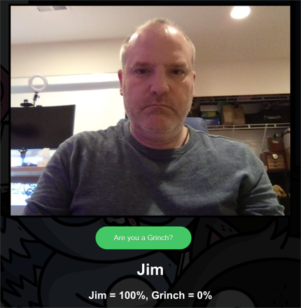
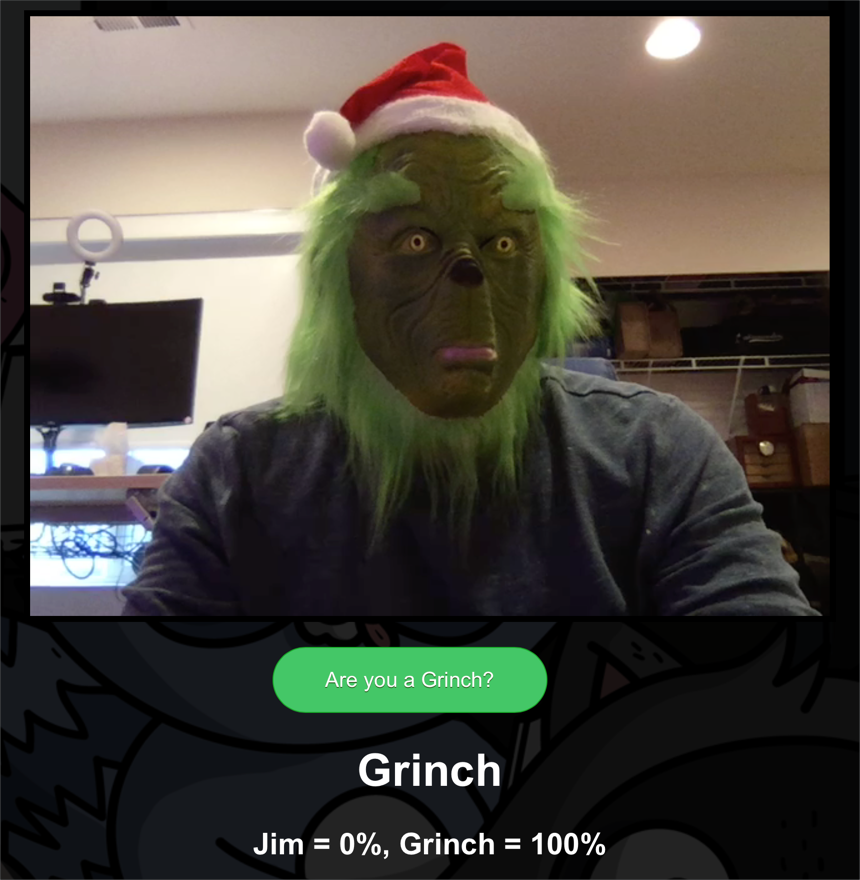
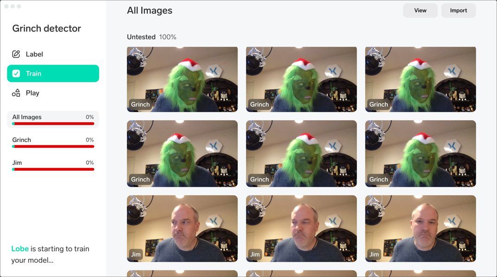

# You're a mean one, Mr Grinch!

Ever wondered how much of a Grinch you are? This app can help you find out!

This Python Flask app demonstrates using a Tensorflow model exported from [Lobe](https://lobe.ai) to detect if you are wearing a Grinch mask or not. The model is currently trained on me with a Grinch mask on and off, so you may get different results unless you train the model yourself!

 

## Train the model

1. Download and install Lobe from [https://lobe.ai](https://lobe.ai)

1. Create a new project called `Grinch Detector`

1. Capture a load of images of you without a [Grinch mask](https://amzn.to/3gyz3Am) and label them with your name

1. Repeat this whilst wearing a [Grinch mask](https://amzn.to/3gyz3Am) and label them `Grinch`

    

1. Wait for the model to train

1. Export the model as Tensorflow

## Run the app

1. Clone this repo

1. Navigate to the `code` folder and open it in a terminal or command prompt

1. Replace the `saved_model.pb`, `signature.json` files and the `variables` folder with the ones from your exported model

1. Create a new Python virtual environment using Python 3.7

    ```sh
    python3.7 -m venv .venv
    ```

    > The tensorflow library version used only supports up to Python 3.7

1. Activate the virtual environment

    * On windows use:

        ```cmd
        .\.venv\Scripts\Activate.bat
        ```

    * On Linux or macOS, use:

        ```sh
        source ./.venv/bin/activate
        ```

1. Restore the pip packages

    ```sh
    pip install -r requirements.txt
    ```

1. Run the flask app

    ```sh
    python -m flask run
    ```

The app will launch on your localhost on port 5000, so from your browser navigate to [127.0.0.1:5000](http://127.0.0.1:5000). You will need to allow access to your camera.

Select the **Are you a Grinch?** button to evaluate if you are a Grinch. Try with and without the Grinch mask.
